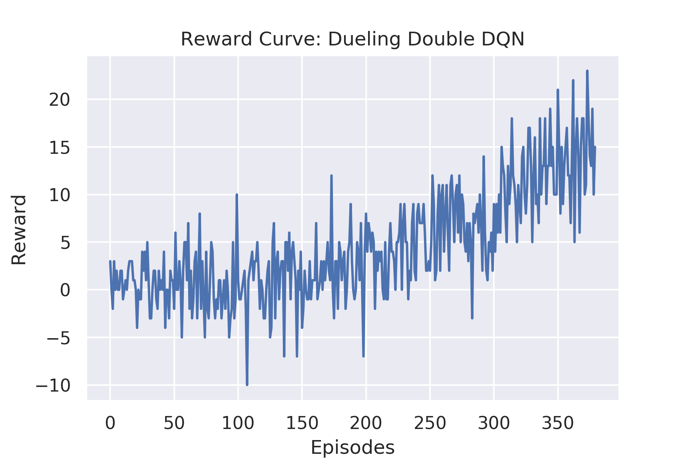

# Navigation using DQN

The project uses **Dueling Double Deep Q-network (DDQN)** with **prioritized experience replay** for training an agent to navigate in a banana world , while trying the maximize the cummulitive reward. The project uses **Unity** environment for training the reinforcement learning agent.

## Table of Contents

* [Trained Agent Demo](#trained-agent-demo)
* [Banana Collector Unity Environment](#banana-collector-unity-environment)
* [Setup](#setup)
    * [System Configuration](#system-configuration)
    * [Environment Setup](#environment-setup)
    * [Instructions for getting started](#instructions-for-getting-started)
    * [Project Structure](#project-structure)
* [Reward Curve](#reward-curve)
* [Bibliography](#bibliography)

##  Trained Agent Demo


## Banana Collector Unity Environment

* Set-up: A multi-agent environment where agents compete to collect bananas.
* Goal: The agents must learn to move to as many yellow bananas as possible
  while avoiding blue bananas.
* Agents: The environment contains 5 agents linked to a single Brain.
* Agent Reward Function (independent):
  * +1 for interaction with yellow banana
  * -1 for interaction with blue banana.
* Brains: One Brain with the following observation/action space.
  * Vector Observation space: 53 corresponding to velocity of agent (2), whether
    agent is frozen and/or shot its laser (2), plus ray-based perception of
    objects around agent's forward direction (49; 7 raycast angles with 7
    measurements for each).
  * Vector Action space: (Discrete) 4 Branches:
    * Forward Motion (3 possible actions: Forward, Backwards, No Action)
    * Side Motion (3 possible actions: Left, Right, No Action)
    * Rotation (3 possible actions: Rotate Left, Rotate Right, No Action)
    * Laser (2 possible actions: Laser, No Action)
  * Visual Observations (Optional): First-person camera per-agent. Use
    `VisualBanana` scene.
* Reset Parameters: None.
* Benchmark Mean Reward: 10

# Setup

## System Configuration
The project was built with the following configuration:

* Ubuntu 16.04
* CUDA 10.0
* CUDNN 7.4
* Python 3.6 (currently ml-agents unity package does not work with python=3.7)
* Pytorch 1.0

Though not tested, the project can still be expected to work out of the box for most reasonably deviant configurations.

## Environment Setup

* Create separate virtual environment for the project using the provided `environment.yml` file
```
conda create -f environment.yml
conda activate navigation
```

## Instructions for getting started!

1. Clone the repository (if you haven't already!)
```bash
git clone https://github.com/1jsingh/rl_navigation.git
cd rl_navigation
```

2. Download the environment from one of the links below.  You need only select the environment that matches your operating system:

    
    - Linux: [click here](https://drive.google.com/open?id=1hbezVc5oOthoQ2VF9c4RPWxsf5M8mxEh)
    - Mac OSX: [click here](https://drive.google.com/open?id=1HTvJxRA24bJKsyzzfy3-J7eOo8XJYpF1N)

    (_For AWS_) If you'd like to train the agent on AWS (and have not [enabled a virtual screen](https://github.com/Unity-Technologies/ml-agents/blob/master/docs/Training-on-Amazon-Web-Service.md)), then please use [this link](https://drive.google.com/open?id=1BpLCYfGcp7y5WPAPPmxxe0mVcYM1LG9N) to obtain the "headless" version of the environment.  You will **not** be able to watch the agent without enabling a virtual screen, but you will be able to train the agent.  (_To watch the agent, you should follow the instructions to [enable a virtual screen](https://github.com/Unity-Technologies/ml-agents/blob/master/docs/Training-on-Amazon-Web-Service.md), and then download the environment for the **Linux** operating system above._)
       
3. Place the downloaded file in the `unity_envs` directory and unzip it.
  ```
  mkdir unity_envs && cd unity_envs
  unzip Banana_Collector_Linux.zip
  ```

4. Follow along with `Navigation.ipynb` to train your own RL agent.

## Project Structure

* `Navigation.ipynb`: notebook for training Double Dueling DQN agent for the Banana Collector Environment
* `dqn_agent.py`: DQN agent and Replay Buffer class
* `model.py`: model definitions for the DQN agent
* `unity_envs`: directory for downloading and storing the unity envs for your system


## Reward Curve


# Bibliography
1. <cite>Wang, Ziyu, et al. "Dueling network architectures for deep reinforcement learning." arXiv preprint arXiv:1511.06581 (2015).
</cite>
2. <cite>Van Hasselt, Hado, Arthur Guez, and David Silver. "Deep reinforcement learning with double q-learning." Thirtieth AAAI Conference on Artificial Intelligence. 2016.</cite>
3. <cite>Mnih, Volodymyr, et al. "Human-level control through deep reinforcement learning." Nature 518.7540 (2015): 529.</cite>
4. <cite>Lillicrap, Timothy P., et al. "Continuous control with deep reinforcement learning." arXiv preprint arXiv:1509.02971 (2015).</cite>