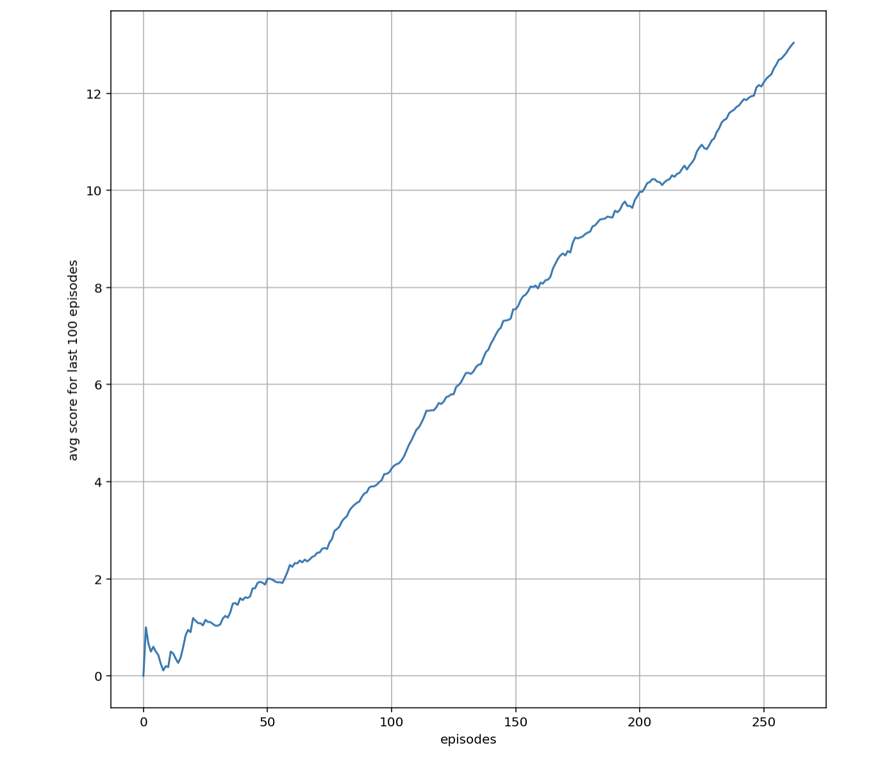

# Project Report

## Learning Algorithm
The current implementation uses a *DQN* (Deep Q Network) in order to train the agent with the following configuration:
* The agent uses fixed Q targets in order minimize confusion and oscillating action values
* The target Q model weights are soft-updated using tau = 1e-3
* The learning step is performed after every "UPDATE_EVERY = 4" timesteps of an episode.
* It uses an epsilon greedy policy for choosing actions with :
  * epsilon.start = 1.0
  * epsilon.end = .01
  * epsilon decay = .995
* Other hyperparamters:
  * gamma = .99
  * learning rate = 5e-4
  
  
  
## Plot of rewards

## Ideas for future work
* Use prioritised experience replay
* Use Double DQN
* Use Dueling DQN
